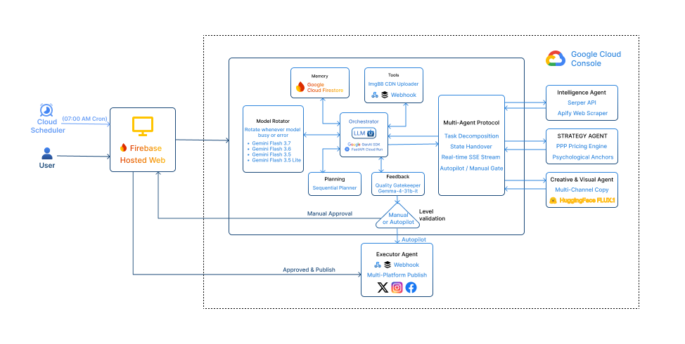

# Automa 🤖 | Autonomous Multi-Agent Marketing Orchestrator

**Submission for the Google #AllThingsAgenticHackathon**

**Live Demo:** https://automa-ai-7cb26.web.app\
**Demo Video:** [Insert YouTube/Drive Link to your ~4-min video]

## 📖 Overview
Automa is an autonomous, multi-agent orchestration system designed to eliminate real-world friction in digital marketing workflows. Instead of relying on manual chat-based prompts, Automa makes autonomous decisions: analyzing product data, formulating pricing strategies, generating creative copy, rendering promotional banners, and executing publishing workflows. To ensure high availability and robust performance, Automa features an intelligent **Model Rotation mechanism** that seamlessly falls back between Google's state-of-the-art models (Gemini) and open weights (Gemma).

## 🏗️ Architecture & Tech Stack

*(Architecture Diagram image)*


**Core Technologies:**
*   **AI Models:** 
    *   **Gemini 3.5 Flash-lite/3.5/3.6/3.7 Flash** (via Gemini API) for primary intelligence, reasoning, and strategy.
    *   **Google Gemma** (via Hugging Face API) integrated as a lightweight, specialized fallback model for text generation and processing.
    *   **Hugging Face FLUX.1** for autonomous creative image generation.
*   **Agent Framework:** Google GenAI SDK orchestrating specialized agent roles, governed by a custom Model Rotator script.
*   **Backend Infrastructure:** FastAPI (Python) hosted on **Google Cloud Run** for scalable, stateless execution.
*   **Database:** **Google Cloud Firestore** for persistent state management and agent memory.
*   **Frontend UI:** React (Vite) + Tailwind CSS, hosted on **Firebase Hosting**.

---

🧠 Multi-Agent Workflow & Model Rotation
Automa utilizes a decoupled agent architecture built for production readiness and failure handling:

Model Rotator (The Orchestrator): Acts as the resilience layer. It monitors API rate limits and model availability. If the primary Gemini model hits a quota limit or fails to respond, the Rotator autonomously redirects the prompt to Google Gemma (via Hugging Face API) to ensure the pipeline never breaks.

Intelligence Agent: Analyzes raw product specs and determines market positioning.

Strategy Agent: Calculates optimal pricing corridors based on psychological thresholds and market segments.

Creative Agent (Gemini/Gemma): Drafts localized, platform-specific marketing copy (English).

Visual Agent: Generates highly specific image prompts based on strategy and invokes Hugging Face FLUX.1 models for banner creation.

Executor Agent: Finalizes the approval state and orchestrates data delivery via webhooks to external publishing platforms.

## ⚙️ Spin-up Instructions (Reproducibility)

Follow these steps to run Automa locally or deploy it to your own Google Cloud environment.

### 1. Prerequisites
Ensure you have the following installed:
*   [Python 3.10+](https://www.python.org/downloads/)
*   [Node.js 18+](https://nodejs.org/)
*   [Google Cloud CLI (`gcloud`)](https://cloud.google.com/sdk/docs/install)
*   [Firebase CLI](https://firebase.google.com/docs/cli)

### 2. Clone the Repository
```bash
git clone [https://github.com/your-username/automa.git](https://github.com/your-username/automa.git)
cd automa

## ⚙️ Spin-up Instructions (Reproducibility)

Follow these steps to run Automa locally or deploy it to your own Google Cloud environment.

### 1. Prerequisites
Ensure you have the following installed:
*   [Python 3.10+](https://www.python.org/downloads/)
*   [Node.js 18+](https://nodejs.org/)
*   [Google Cloud CLI (`gcloud`)](https://cloud.google.com/sdk/docs/install)
*   [Firebase CLI](https://firebase.google.com/docs/cli)

### 2. Clone the Repository
```bash
git clone [https://github.com/your-username/automa.git](https://github.com/your-username/automa.git)
cd automa

3. Environment Variables Setup
You must configure the environment variables for both the backend and frontend before running the application. We have provided example files for reference.

Backend (/backend/.env):
Duplicate .env.example to .env inside the backend folder and populate your keys:

GEMINI_API_KEY="YOUR_API_KEY_HERE"
SERPER_API_KEY = "YOUR_API_KEY_HERE"
APIFY_API_TOKEN = "YOUR_API_KEY_HERE"
HF_TOKEN="YOUR_API_KEY_HERE" 
PUBLISH_WEBHOOK_URL="YOUR_API_KEY_HERE"
IMGBB_API_KEY = "YOUR_API_KEY_HERE"

Note: You will also need your Firebase serviceAccountKey.json placed inside the backend directory (or designated subfolder) to authenticate with Firestore.

Frontend (/frontend/.env):
Duplicate .env.example to .env inside the frontend folder:

# For local testing, use: http://localhost:8000
# For cloud testing, use your Cloud Run URL:
VITE_API_BASE_URL="[https://automa-backend-XXXXXXXXXX.asia-southeast2.run.app](https://automa-backend-XXXXXXXXXX.asia-southeast2.run.app)"

4. Local Development Run
Terminal 1: Start the Backend (FastAPI)

cd backend
python -m venv venv
source venv/bin/activate  # On Windows use: venv\Scripts\activate
pip install -r requirements.txt
uvicorn main_api:app --reload --port 8000 or

go to your root directory (ex.  D:\Proj\Agent\Automa>)
then type  npm run dev:all

Terminal 2: Start the Frontend (Vite/React)

cd frontend
npm install
npm run dev

The UI will be accessible at http://localhost:5173.


5. Cloud Deployment Guide (Google Cloud & Firebase)
Automa is designed to be production-ready and deployed natively on Google Cloud.

before deploying make sure you've created env.json with then following structure inside:
{
"GEMINI_API_KEY":"YOUR_API_KEY_HERE",
"SERPER_API_KEY":"YOUR_API_KEY_HERE",
"APIFY_API_TOKEN":"YOUR_API_KEY_HERE",
"HF_TOKEN":"YOUR_API_KEY_HERE",
"PUBLISH_WEBHOOK_URL":"YOUR_API_KEY_HERE",
"IMGBB_API_KEY":"YOUR_API_KEY_HERE",
"CRON_SECRET_KEY":"YOUR_API_KEY_HERE"
}
the you already good to go.

Deploying the Backend to Google Cloud Run:
cd backend
gcloud run deploy automa-backend \
  --source . \
  --region asia-southeast2 \
  --allow-unauthenticated \
  --min-instances 0 \
  --max-instances 1 \
  --memory 512Mi \
  --cpu 1 \
  --env-vars-file env.json


Deploying the Frontend to Firebase Hosting:
Make sure you update the VITE_API_BASE_URL in your frontend .env to point to the newly generated Cloud Run URL before building.
cd frontend
npm run build
firebase deploy --only hosting